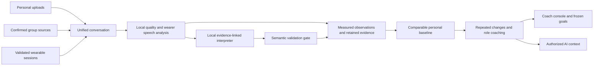

# PSYCON

PSYCON is a personal communication coach designed to grow into a wearable AI system. It connects a person's conversations over time, measures how they speak in comparable situations, and helps them practice specific adjustments with evidence they can inspect.

The first product is a local, English-language private pilot using uploaded recordings. Its software reuses the speech models, research console, backend, and device protocol already in this repository. Continuous wearable capture feeds the same conversation model once physical transport and attribution have been validated.

Start with [the access and running guide](docs/START_HERE.md). It covers startup, accounts, the coaching flow, sharing, and common problems. The [user-system design](docs/USER_SYSTEM.md) describes the simpler experience to build next.

## Vision and theory

Communication changes with the setting, the relationship, the objective, and the person speaking. A long explanation in a presentation has a different purpose from the same explanation during a sales discovery call. PSYCON therefore compares a person with their own history under comparable conditions rather than assigning a universal communication score.

The central loop is **observation → personal baseline → repeated change → evidence review → practical adjustment → later comparison**. Acoustic features establish measured facts such as speaking share or pace. Conversation context and reviewed semantic events can support interpretations such as acknowledgement or clarification. Those layers stay distinct: simultaneous speech establishes overlap, but it does not establish that someone intended to interrupt or was defensive.

A recurring observation needs several independent conversations. Coaching presents a possible effect and one adjustment, with uncertainty and retained timing references. Later measurements can show change, but they cannot establish that coaching caused it or that an audience understood an explanation. PSYCON does not infer a diagnosis or a fixed personality from speech.

The longer-term vision is an authorized context layer for another AI application: supported communication patterns, current goals, evidence counts, dates, uncertainty, and relevant session context. The current product exports that context through an API; it does not add a new chat application. See [the full vision and reasoning](docs/PSYCON_VISION.md).

## Project progress

The recordings workflow is implemented: private profiles, queued voice enrollment, uploads, explicit research-source links, wearer observations, baseline progress, recurring deviations, role coaching, goals, access grants, context export, and deletion. A synthesized-speech run exercised the real local speech and LLM path. Audio firmware implements continuous DMA capture and Protocol v2 Wi-Fi transport; wrist firmware remains a sensor scaffold.

This is not a completed product release. The two-person private pilot, independently annotated semantic evaluation, physical device transport and power measurements, real wrist sensing, and hosted personal deployment remain open. Detailed coverage and verification evidence live in [implementation status](docs/IMPLEMENTATION_STATUS.md), so this README does not use a misleading overall completion percentage.

## How it works

1. **Create a private profile and enroll a voice.** An operator provisions a wearer token, the wearer selects a role and permits processing, and three 5–10 second clips create an encrypted voice embedding on the worker. A research participant enters a history only through an explicit identity link.
2. **Add a conversation and its context.** Upload WAV, MP3, or OGG audio and enter its date, setting, conversation type, microphone, topic, relationship, and objective. Original media hashes identify duplicate uploads; original timestamps remain the timing reference.
3. **Measure the wearer's speech.** Local quality checks, Whisper transcription, Community-1 diarization, and SpeechBrain verification identify usable wearer intervals. Analysis measures speech share, turn length, pauses, response gaps, pace, vocabulary diversity, pitch, level, overlap, and voice-quality estimates. Uncertain identity is excluded from personal baselines.
4. **Build a comparable baseline.** The default pilot rule requires five eligible conversations across three days and 30 minutes of usable wearer speech. Each conversation contributes one summary to median and median absolute deviation statistics. Language, conversation type, microphone, and setting define separate cohorts.
5. **Review repeated changes and practice.** Later sessions compare with an earlier reference. At least three later independent conversations must support a deviation before it appears as recurring. Role coaching combines the measurement, context, reference, evidence, possible effect, uncertainty, and a practical adjustment. A selected goal freezes its pre-goal reference.
6. **Export supported context or delete history.** The wearer can grant seven-day read-only reviewer access or context-only access. Context excludes recordings, embeddings, and evidence text. Corrections and deletion invalidate derived reports and goals whose reference changed; cleanup retries remove remaining personal raw files.

The [architecture and API reference](docs/COMMUNICATION_ARCHITECTURE.md) describes the records, algorithms, state transitions, and failure behavior behind this flow.

## Technical architecture

The start page, coach, research console, and device console share one Jinja page template and CSS design system. All use the existing Flask, HTML, CSS, and plain JavaScript stack. [Design conventions](DESIGN.md) document the shared colors, typography, controls, and responsive layouts.

| Component | Implementation and responsibility |
| --- | --- |
| Web and API | Flask serves the `/` start page, `/coach`, the existing `/group` research console, the `/devices` dashboard, and `/api/v1/communication`. Wearer APIs require scoped bearer credentials. |
| Persistence | PostgreSQL stores personal documents in additive migrations alongside existing research tables. S3-compatible storage retains research objects; a separate encrypted spool holds temporary personal uploads. |
| Speech analysis | Existing NumPy quality/acoustic extraction, faster-whisper, pyannote Community-1, SpeechBrain ECAPA, and Praat voice-quality code run locally. |
| Longitudinal coaching | A dedicated communication service owns eligibility, robust baselines, content-addressed snapshots, repeated deviations, role lenses, goals, and evidence lineage. |
| Local interpretation | Ollama runs `qwen3.5:4b` with a pinned digest, an 8K context limit, bounded windows, and evidence-reference validation. There is no automatic cloud fallback. |
| Processing | One inference worker handles the pilot sequentially and releases speech models before LLM interpretation. A separate device-only CPU worker can serve existing ingestion work. |
| Wearable transport | ESP32 I2S/DMA captures 16 kHz PCM in 0.5-second Protocol v2 chunks. Wi-Fi carries audio; authenticated BLE provisions the device and controls pause/resume. |
| Research | Guarded face-linked group analysis, A–T psychologist marksheets, participant-safe evaluation, WESAD experiments, and exports remain separate from coaching. |

The role rubrics cover general communication, leadership, sales, teaching, law, debate, negotiation, medicine, student communication, and presentations. They combine shared measurements with evidence-linked behavior proposals and explicit response-opportunity denominators. Jargon, explanation structure, supported reasoning, concessions, and responses remain unavailable automatically until independent evaluation passes; audience understanding is never inferred. See [role definitions and opportunity rules](docs/COMMUNICATION_ROLE_RUBRICS.md).



## Privacy and evidence

New personal media and enrollment clips are encrypted while queued. Successful processing deletes raw media and full transcripts; failed raw uploads expire after 24 hours. Derived measurements, anonymous timing records, and bounded redacted evidence excerpts remain until the wearer deletes them. Redaction reduces exposure but is not a guarantee of perfect anonymization. Existing research recordings retain their existing consent and retention policy.

LLM output must reference supplied evidence IDs. Automated semantic types remain unavailable until a matching model evaluation contains at least 50 independent annotated exchanges, covers every role, and reaches at least 90% precision for each enabled type. Wearer corrections take precedence. Missing data, uncertain identity, incompatible microphones, and isolated incidents must remain visible limitations rather than becoming scores or psychological claims.

## Open the web app

These steps use the runtime and models already installed in this folder. Open Docker Desktop and wait for its engine to start. Then open PowerShell and run these commands in order.

The first command starts the database and object store. The second starts the local AI. The third starts the web server, so leave this terminal open.

```powershell
cd C:\Users\USER\Desktop\code\PSYCON
powershell -ExecutionPolicy Bypass -File release_tools/local-runtime.ps1 services
powershell -ExecutionPolicy Bypass -File release_tools/local-runtime.ps1 ollama
powershell -ExecutionPolicy Bypass -File release_tools/local-runtime.ps1 web
```

Open a second PowerShell terminal and start the processing worker. Leave it open so enrollment and uploads can finish.

```powershell
cd C:\Users\USER\Desktop\code\PSYCON
powershell -ExecutionPolicy Bypass -File release_tools/local-runtime.ps1 worker
```

Open [PSYCON](http://127.0.0.1:8000/) in your browser. The start page links to every workspace.

| Page | Use it for |
| --- | --- |
| [Personal coach](http://127.0.0.1:8000/coach) | Connect your wearer token, enroll with three voice clips, upload English recordings, and review your progress. |
| [Group research](http://127.0.0.1:8000/group) | Analyze discussion videos and review participant marksheets. |
| [Device console](http://127.0.0.1:8000/devices) | Inspect device sessions, worker status, and exports with your operator credential. |

Each workspace has a Home link. If the server is already running, open it instead of starting another copy on port 8000. Press `Ctrl+C` in the web and worker terminals to stop them.

For your first account, follow [the wearer setup guide](docs/START_HERE.md). It covers account creation, enrollment, uploads, sharing, deletion, and troubleshooting. The [technical runbook](docs/COMMUNICATION_COACH.md) covers model pinning and Compose alternatives. Runtime files and service data stay inside `.runtime`; Docker Desktop and the GPU driver are system prerequisites. Keep secrets in the ignored root `.env` file.

## Build and verify

Group recordings now continue from spreadsheet upload to per-person feedback under shared discussion context. Human ratings stay separate from AI practice suggestions. Run `powershell -ExecutionPolicy Bypass -File release_tools/local-runtime.ps1 train-group` to train and save PSYCON's group rating models from PostgreSQL. See [group feedback and training](docs/GROUP_FEEDBACK_AND_TRAINING.md) for the full flow and data requirements.

```powershell
powershell -ExecutionPolicy Bypass -File release_tools/local-runtime.ps1 test
powershell -ExecutionPolicy Bypass -File release_tools/local-runtime.ps1 protocol-test
.runtime/node/node.exe .runtime/node/npm/bin/npm-cli.js --prefix protocol run typecheck
powershell -ExecutionPolicy Bypass -File release_tools/local-runtime.ps1 firmware-build
docker compose -f docker-compose.yml -f docker-compose.local.yml build api worker minio
```

The PostgreSQL lifecycle test is opt-in through `PSYCON_COMMUNICATION_TEST_DATABASE`; it creates and removes its own synthetic records. Human semantic annotation and physical measurements are separate release checks. The [reproducibility matrix](docs/REPRODUCIBILITY.md) lists the remaining research, demo, protocol, and validation commands.

## Repository and documentation

| Path | Purpose |
| --- | --- |
| `backend/communication/` | Personal profiles, recording jobs, observations, baselines, interpretation, coaching, source adapters, and APIs. |
| `backend/group/`, `research/` | Existing group-video workflow, marksheets, evaluation, and research exports. |
| `ml/src/` | Shared audio, transcription, speaker verification, voice quality, language, wrist features, and research models. |
| `firmware/ear/`, `firmware/wrist/` | Continuous audio transport and the optional wrist bring-up scaffold. |
| `protocol/` | Canonical Protocol v2 fixtures and Python, TypeScript, and C++ contracts. |
| `tests/`, `validation/` | Software regression, semantic evaluation, integration scenarios, and evidence-gated physical procedures. |

Read [vision](docs/PSYCON_VISION.md) for the product theory, [architecture](docs/COMMUNICATION_ARCHITECTURE.md) for the implementation, [pilot operations](docs/COMMUNICATION_COACH.md) for running it, and [status](docs/IMPLEMENTATION_STATUS.md) for what is built and what remains. [Backend](docs/BACKEND.md), [audio](docs/AUDIO_PIPELINE.md), and [device features](docs/DEVICE_FEATURES.md) retain the shared technical contracts.

The [historical research overview](docs/RESEARCH_LEGACY.md), [34-chapter engineering PRD](docs/engineering_prd/), [group benchmark report](docs/group_discussions_final_report.md), and [physical validation runbook](docs/validation/WEEK_6_RUNBOOK.md) preserve the work PSYCON builds on. The new communication documents govern the personal product direction; the older PRD still supplies hardware, electrical, study, and safety requirements. Historical reports do not establish longitudinal coaching validity.
