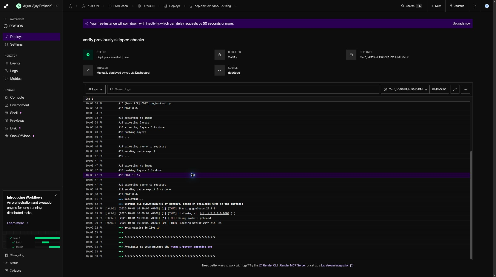
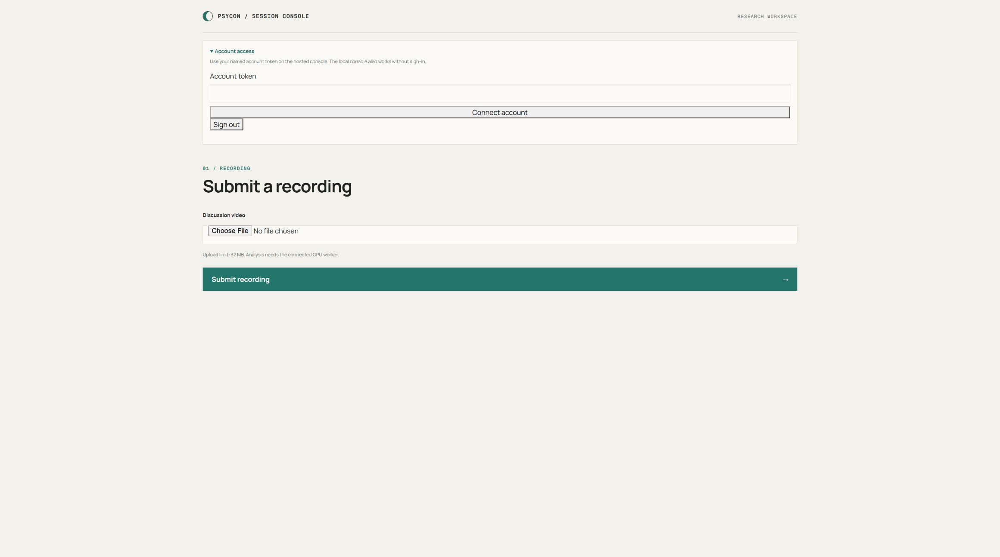

# Deployment

The personal pilot is currently local. Its spool must be shared, profile key stable, and LLM local and pinned; use [the communication runbook](COMMUNICATION_COACH.md). Hosted checks below are a dated record of group research, not a hosted personal product or authorization to connect a local worker to production.

## Current hosting

Checked on 1 October 2026 using the open Render and Cloudflare dashboards.
The existing site is https://psycon.onrender.com. Render successfully deployed
commit `dad6cbc` from `week-5-group-observation` on 1 October 2026.
The configured source branch remains `main`; a specific-commit deployment was
used, and automatic deployment was disabled by Render. The source work has since been merged into local `main` as `2ee246f`; this update does not verify a new hosted deployment.
The free CPU instance is in Singapore. The private R2 bucket remains private.

The live health and readiness endpoints returned 200, with PostgreSQL and
object storage ready. Anonymous group requests returned 401, and the hosted
console displayed named-account sign-in and the 32 MB upload limit.
`PSYCON_RUN_WORKER=false` keeps inference off the small web instance.
`PSYCON_MAX_GROUP_VIDEO_BYTES=33554432` limits memory use while uploads still
read the whole file. Larger recordings need a larger web instance or a streaming
upload implementation. These checks verify web availability, not completed
hosted analysis. The local GPU worker has not been connected to production;
that connection is awaiting specific approval for database and recording access.

During the release smoke check, the local Docker runtime stopped all its
containers while video inference and API checks were running together.
The extra app-triggered PSYCON run was interrupted; it is not another
completed benchmark. The saved 66 benchmark runs remain the comparison evidence.

## Web server

Render's existing settings can use the root Dockerfile and
`sh backend/start_render.sh`, with `/api/v1/ready` as the health check. The final
Docker stage is now `web`, so a normal build excludes CUDA dependencies.
Keep `PSYCON_RUN_WORKER` unset or `false` on the web server.

Set `PSYCON_ENV=production`. Supply unique `PSYCON_SECRET_KEY` and
`PSYCON_BOOTSTRAP_OPERATOR_TOKEN`, the PostgreSQL connection in
`PSYCON_DATABASE_URL`, and these private R2 settings:

- `PSYCON_S3_ENDPOINT_URL` and `PSYCON_S3_PUBLIC_ENDPOINT_URL`: the same R2 S3 endpoint, not a public bucket URL. Downloads use signed URLs.
- `PSYCON_S3_BUCKET`, `PSYCON_S3_REGION`, `PSYCON_S3_ACCESS_KEY`, and `PSYCON_S3_SECRET_KEY`.

The existing service already has these key names configured. Their values
were kept masked. Provision named group accounts through
`POST /api/v1/group-accounts` using the bootstrap operator bearer token.
Use the issued named token in Account access on `/group`. The browser keeps
a signed, HttpOnly, Secure, SameSite=Strict session in production. Every group
request checks the account's current role and revocation state. Anonymous
production requests cannot use the local operator fallback.

## Analysis worker

Run the worker on an NVIDIA GPU host with Docker GPU support. It must use
the same PostgreSQL database and private R2 bucket as the web server, not the
localhost database from the development Compose file. Keep its environment
file outside Git. Include `HF_TOKEN` with accepted Community-1 model access,
the production settings above, and these model device settings:

```text
PSYCON_DIARIZATION_DEVICE=cuda
PSYCON_SPEAKER_DEVICE=cuda
PSYCON_WHISPER_DEVICE=cuda
PSYCON_COMMUNITY1_REVISION=3533c8cf8e369892e6b79ff1bf80f7b0286a54ee
```

Build and start it from the same code revision as the web server:

```sh
docker build --target nvidia -t psycon-worker .
docker run -d --restart unless-stopped --gpus all \
  --env-file /secure/psycon-worker.env \
  -v psycon-models:/opt/psycon/hf-cache \
  psycon-worker python -m backend.worker
```

Start one worker first and check its database heartbeat and a completed
group job. Confirm that assigned playback loads, unknown intervals stay
unknown, and a missing model or token produces an explicit failure. PSYCON
training eligibility must never be supplied by another method.

For concurrent wearable traffic, run a separate CPU worker using the web
image and `python -m backend.worker --device-only`, with the same database
and storage settings. It never claims group jobs, so a long video run cannot
hold up the wearable queue on that worker.

If a runtime stops during voice inference, first verify the worker owning
the job has stopped. Then recover that exact job using its ID and `locked_by`
worker ID from `group_jobs`:

```sh
python -m backend.group.recover_voice_job --job-id JOB_UUID \
  --worker-id STOPPED_WORKER_ID --worker-stopped --reason runtime_interrupted
```

This marks only that voice method failed and clears its profiles in one
transaction. The Faces tab can then retry it. It preserves the other methods.
Never use this command against a live worker; it does not cancel inference.

## Local verification

`docker compose up --build -d` starts the local API, GPU worker, PostgreSQL,
and object storage. Published ports bind to `127.0.0.1`.
The previously pinned MinIO container stopped being publicly pullable, so
`deploy/minio` builds a local image from the official release binary and
checks its SHA-256 before installing it. This older storage build is for local
development; use private R2 for hosted storage.

The two nonsecret web settings above were saved in Render, then the tested
commit was deployed. Credentials and bucket visibility were unchanged.
The GPU access decision and capacity for larger recordings remain open.




