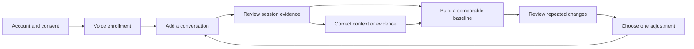

# A simpler PSYCON user system

PSYCON should help someone review a conversation and choose a useful next step. The interface should make that task easy to find. Setup commands, model settings, and technical checks belong with the operator.

This is the proposed user experience. The current software already supports the underlying pilot workflow, but the screens and conveniences described here still need implementation.

## Give each person a clear job

| Person or application | Job | Access |
| --- | --- | --- |
| Wearer | Upload, review, practice, correct, and decide what to share | Their own history |
| Reviewer | Help interpret examples with permission | The history covered by a read-only grant |
| Operator | Run services, create accounts, and confirm source links | Setup and research operations under existing permissions |
| Connected AI application | Use supported context for another task | The context API under a separate grant |

A professional role, such as teaching or sales, changes the coaching focus. It does not give someone extra access. Operators still need a wearer grant to read personal coaching history through the private API.

## Make the first visit a short guided setup

1. **Open your account.** Explain what the account gives access to. The current pilot uses a saved token. A later invitation flow should hide that setup detail behind a clear sign-in screen.
2. **Choose a purpose.** Ask for the role and one plain goal, such as "make more space for questions." Save the purpose before a numeric baseline is ready. Start measured goal tracking once suitable earlier data exists.
3. **Agree to recording and retention.** Explain what processing keeps and deletes before asking for consent. Show separate choices for voice enrollment and conversation processing.
4. **Record three voice clips.** Guide the wearer through one clip at a time. Show whether each clip is long and clear enough. Explain how to replace a failed clip.
5. **Add a first conversation.** Ask only for the file, date, setting, conversation type, and microphone. Put the extra context fields behind an optional section.

Save progress between visits. If enrollment is still processing, say so and show the next available action. A spinning icon without an explanation leaves people guessing.

## Use four main pages

### Home

Show the person's current stage first. A new user sees enrollment or baseline progress. Someone with enough history sees their selected practice goal and one supported observation worth reviewing.

Keep Add a conversation as the main action after enrollment. Show concrete progress, such as "3 of 5 conversations and 18 of 30 usable minutes." Explain what is missing when the count cannot advance.

When there is no recurring pattern, say "There isn't enough repeated evidence yet." The person can still review individual sessions. An empty result should feel understandable.

### Conversations

List recordings by their actual conversation date. Each row shows the setting and status. Keep processing status separate from identity and evidence quality, because a completed job may still be unsuitable for a baseline.

Opening a conversation should show context, measured facts, interpretation, and evidence in that order. Use plain labels such as Speaking time and Pace, while keeping exact units available. Clicking a claim opens its excerpt and timing reference.

Replace JSON correction prompts with small forms. Let users edit context fields, select an observed event, and choose its evidence. Paired response labels need both the other person's turn and the wearer's reply. Show the effect on reports before saving a correction.

### Practice

Let a person choose one active practice goal as the default. Keep older goals in a history list. Suggest a practical action that fits the evidence, such as "answer the question first, then give the reason."

Show the frozen earlier reference and later comparable sessions together. If later conversations contain no relevant opportunity, explain why a comparison is unavailable. A missing question opportunity should not look like a failed attempt to answer questions.

Each coaching card should contain the observation, context, earlier comparison, supporting examples, possible effect, uncertainty, and one adjustment. Keep those details in a consistent order so the user knows where to look.

### Settings and sharing

Put role, consent, enrollment, access grants, context export, and deletion here. Keep destructive actions away from routine upload controls.

Explain reviewer access and AI context access in plain language before creating a grant. Show its scope and expiry date. Make revocation easy to find. Warn that previously downloaded files remain with their recipient.

## Let the app explain its state

| Situation | Message | Next action |
| --- | --- | --- |
| Enrollment is needed | "Add three short voice recordings so we can find your speech." | Enroll voice |
| A recording is queued | "Your recording is waiting for local analysis." | Show queue status |
| The worker is unavailable | "Analysis is paused because the worker is offline." | Operator starts the worker |
| Voice identity is uncertain | "We couldn't reliably identify your speech in this recording." | Review the recording or enroll again |
| A baseline is incomplete | "We need more usable speech in this setting." | Show the missing counts |
| A microphone changed | "This recording uses a different capture setup." | Keep it in its own comparison group |
| Semantic review is pending | "This interpretation needs validation before it can appear automatically." | Show available measured facts |
| A goal reference changed | "A correction changed the earlier data for this goal." | Review and create a new reference |
| Cleanup is pending | "Access has been removed. File cleanup is still running." | Show completion after the worker confirms it |

These messages are proposed product copy. Several status signals already exist, but automatic refresh, worker warnings, and deletion completion tracking still need user-facing work.

## Reduce repeated work

Remember the person's usual setting and microphone as choices they can reuse. Keep their saved labels stable so comparable recordings stay together. Ask them to confirm a suggested context before using it.

Update job status automatically. Preserve a form after an upload error. Offer Retry when the original media still exists, and explain when a fresh upload is needed. Keep keyboard navigation, visible labels, and status messages readable on a narrow screen.

The operator should have a separate setup page for service health, queue status, account creation, and source linking. Its first action should be Start local services. Detailed logs can sit behind a diagnostics link. Wearers should never need to read model digests or edit JSON to complete their normal flow.

## Keep the flow honest

The loop should stay useful before a pattern appears. Early sessions offer measured observations and visible baseline progress. Later sessions offer comparisons and supported repeated changes. Neither stage needs a universal communication score.

## Build the changes in this order

1. **Make setup easier.** Add guided enrollment, a simple operator account form, and reusable context choices. Keep the current token access model until account recovery has a defined design.
2. **Make review easier.** Split the long coach page into the four pages above. Add automatic status updates, evidence links, and correction forms.
3. **Make practice clearer.** Support one selected active goal, explain opportunity counts, and show the before-and-after reference without claiming causation.
4. **Make control visible.** Show grant expiry, revocation, deletion progress, and what data remains. Keep downloadable context separate from full history access.

A wearer should be able to enroll, upload, review an example, correct it, select a goal, export context, and delete history without opening a terminal. The operator handles startup. Test that full path with two private users before treating the design as finished.

For the software available today, use [the running guide](START_HERE.md). For data rules and API details, use [architecture](COMMUNICATION_ARCHITECTURE.md) and [role definitions](COMMUNICATION_ROLE_RUBRICS.md).
