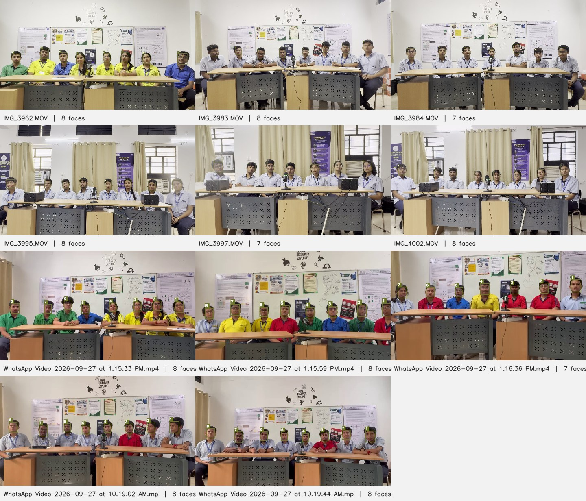

# Final report: voice profiles from the group discussions

[Read the illustrated PDF](../output/pdf/group_discussions_final_report.pdf) or [edit its LaTeX source](group_discussions_final_report.tex).

We tested all 11 recordings with the same source audio and numbered faces. They contain 85 marked places across the videos. These are person-recording slots, since someone may appear in more than one recording. Nemotron offline produced 51 ready profiles, while guarded PSYCON produced 57. PSYCON therefore remains our main source. Nemotron stays in the benchmarks.

| Method | Ready profiles out of 85 | Usable seconds |
| --- | ---: | ---: |
| Original | 40 | 395.14 |
| Earlier NVIDIA | 13 | 524.92 |
| First PSYCON | 45 | 4,364.61 |
| Guarded PSYCON | 57 | 4,640.04 |
| Nemotron streaming with current checks | 51 | 4,849.58 |
| Nemotron offline with current checks | 51 | 5,179.03 |

## How we did it

1. We extracted shared 16 kHz audio and numbered the visible faces.
2. Community-1 or Nemotron found anonymous speaker turns and detected overlap.
3. TalkNet checked the visible speaker. SpeechBrain compared that voice across separate turns. Repeated, consistent evidence linked a voice to a face.
4. A profile needed three usable seconds and a valid voice embedding. We removed detected overlap, uncertain boundaries, and nonusable audio windows from acoustic measurements. The code built playback files from the original audio.

## What changed for Nemotron

The teammate uses Nemotron's offline preset. It processes 27.2 seconds at a time and looks ahead by 3.2 seconds. Our earlier NVIDIA mode used 0.72-second chunks and 0.32 seconds of lookahead. Both keep speaker history, but offline gets more context before labeling speech. We added the official offline preset with pinned weights and the current guarded matcher. We also tested the saved streaming turns with that matcher as a control.

The streaming control produced 51 profiles. It reused the earlier NVIDIA turns with the same face and voice checks as PSYCON. The offline run used those checks too. The offline setting matched that control's coverage. Offline retained 5,179.03 usable seconds, compared with 4,640.04 from PSYCON. It gave us more audio across fewer participants, but this does not prove better identity accuracy.

Offline Nemotron found 4 slots PSYCON left incomplete, but lost 10 of PSYCON's ready slots. 5 assigned intervals disagreed with saved PSYCON face observations. These clips need inspection; the check does not tell us which model is correct. The results do not prove that PSYCON has reached the maximum recoverable coverage.

The earlier NVIDIA runs used 80 anonymous channels across the recordings. Their 13 ready profiles counted face-linked outputs. The teammate's repository contains no saved results for these videos, and its face mapping is manual. We tested its proposed settings locally instead of treating its channel count as a confirmed profile count.

Its `usable profiles` counter uses total channel speech, including overlap. Our profile gate also requires a face link, isolated speech, and a valid voice embedding. We kept these checks fixed when testing the new Nemotron paths.

| Recording | Faces | Original | Earlier NV | First PS | Guarded PS | Stream+ | Offline+ |
| --- | ---: | ---: | ---: | ---: | ---: | ---: | ---: |
| IMG_3962 | 8 | 5 | 1 | 5 | 6 | 5 | 5 |
| IMG_3983 | 8 | 1 | 0 | 4 | 5 | 4 | 3 |
| IMG_3984 | 7 | 4 | 1 | 4 | 5 | 6 | 4 |
| IMG_3995 | 8 | 4 | 0 | 2 | 4 | 4 | 5 |
| IMG_3997 | 7 | 3 | 3 | 5 | 6 | 6 | 6 |
| IMG_4002 | 8 | 5 | 1 | 2 | 3 | 3 | 4 |
| WA 1.15.33 PM | 8 | 5 | 1 | 4 | 5 | 5 | 5 |
| WA 1.15.59 PM | 8 | 3 | 2 | 3 | 4 | 4 | 5 |
| WA 1.16.36 PM | 7 | 3 | 0 | 3 | 6 | 6 | 5 |
| WA 10.19.02 AM | 8 | 2 | 1 | 5 | 5 | 2 | 4 |
| WA 10.19.44 AM | 8 | 5 | 3 | 8 | 8 | 6 | 5 |

## What remains uncertain

Guarded PSYCON still leaves 28 slots incomplete. All have zero assigned clean speech. Seventeen have tentative visual candidates for review, and eleven have none. This does not prove those people were silent. 1420.81 seconds of clean speech remain unlinked to a face, and the model detected 472.54 seconds of overlap.

Overlapping source audio can appear in playback, but it stays out of a single person's acoustic profile. Nine PSYCON slots have no person-specific playback clip. Three recordings have only seven marked faces. An unmarked eighth person cannot receive a numbered face profile from those markings. The videos also lack a sustained vowel task, so that measurement is unavailable.

These are model-supported assignments. We checked sampled original-video frames in one earlier recording, but most assignments have no independent human labels. More profiles do not establish better accuracy. Psychological predictions have not been validated. Training continues to use current, ready PSYCON profiles, and the Nemotron benchmark outputs have a separate schema.

All 66 recording-method runs finished. Automated tests passed with six skips. Artifact validation passed with zero errors across 377 playback and review clips. It checked source intervals, profile gates, and audio timing. The PDF pages were checked after compilation.

Sources and detail: [teammate code](https://github.com/CodeSakshamY/PSYCON-Diarization_Model/blob/d7d018dba76ca59da144b357ed223757596dc0c0/neemotron_bench/core.py), [official Nemotron model card](https://huggingface.co/nvidia/Nemotron-3-Diarization), [benchmark measurements](nemotron_benchmark_report.md), and [rejection audit](psycon_rejection_audit.md).
