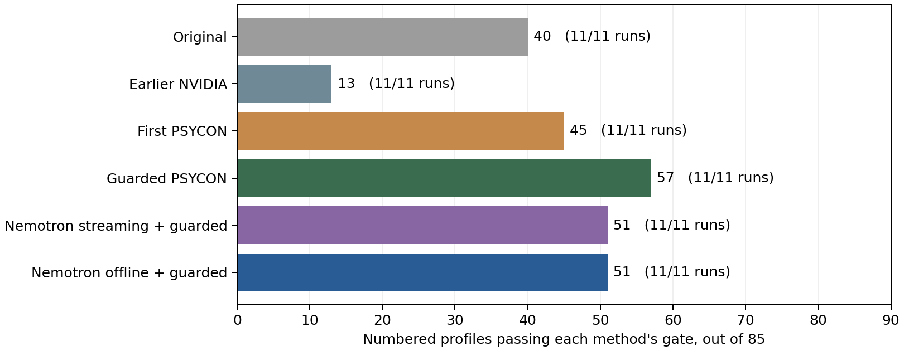
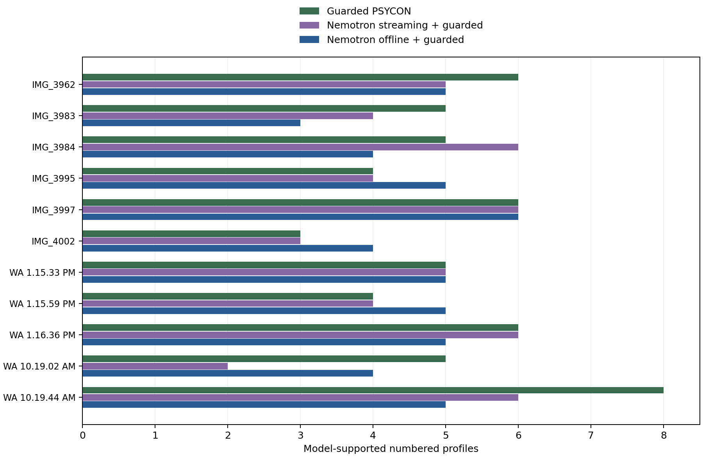

# Nemotron comparison

This benchmark keeps the earlier runs and adds the official Nemotron offline preset. It also replays the earlier low-latency turns through the current guarded face and voice checks. Both new paths use the same gate as guarded PSYCON. Their outputs have a separate schema and cannot enter PSYCON training.

| Recording | Marked | Original | Earlier NVIDIA | First PSYCON | Guarded PSYCON | Guarded streaming | Guarded offline |
| --- | ---: | ---: | ---: | ---: | ---: | ---: | ---: | ---: |
| IMG_3962.MOV | 8 | 5 | 1 | 5 | 6 | 5 | 5 |
| IMG_3983.MOV | 8 | 1 | 0 | 4 | 5 | 4 | 3 |
| IMG_3984.MOV | 7 | 4 | 1 | 4 | 5 | 6 | 4 |
| IMG_3995.MOV | 8 | 4 | 0 | 2 | 4 | 4 | 5 |
| IMG_3997.MOV | 7 | 3 | 3 | 5 | 6 | 6 | 6 |
| IMG_4002.MOV | 8 | 5 | 1 | 2 | 3 | 3 | 4 |
| WhatsApp Video 2026-09-27 at 1.15.33 PM.mp4 | 8 | 5 | 1 | 4 | 5 | 5 | 5 |
| WhatsApp Video 2026-09-27 at 1.15.59 PM.mp4 | 8 | 3 | 2 | 3 | 4 | 4 | 5 |
| WhatsApp Video 2026-09-27 at 1.16.36 PM.mp4 | 7 | 3 | 0 | 3 | 6 | 6 | 5 |
| WhatsApp Video 2026-09-27 at 10.19.02 AM.mp4 | 8 | 2 | 1 | 5 | 5 | 2 | 4 |
| WhatsApp Video 2026-09-27 at 10.19.44 AM.mp4 | 8 | 5 | 3 | 8 | 8 | 6 | 5 |
| Total | 85 | 40 | 13 | 45 | 57 | 51 | 51 |

The earlier NVIDIA result of 13 was the number of ready face-linked profiles. Its raw output used 80 anonymous channels across the 11 recordings. Those quantities describe different stages of the pipeline.

The teammate's `usable profiles` counter counts channels above a user-set total-speech duration, including overlap. It does not check a face link or a SpeechBrain embedding. Our new comparisons use the same isolated-speech and identity gate as PSYCON, so those counts are not interchangeable.

The teammate's code uses NeMo's 340-frame chunk and 40-frame lookahead preset, with a persistent speaker cache. We use that same official preset in the already-pinned Transformers implementation. The downloaded repository contained code and a notebook, but no saved outputs for these recordings. This therefore tests the proposed configuration, rather than reproducing an undocumented teammate score.

Raw probabilities are retained locally. Activity thresholds of 0.3, 0.5, and 0.7 are reported separately; the face-profile comparison uses 0.5. Threshold changes are diagnostics, not a reason to assign an extra face. Counts do not establish diarization accuracy, and detector disagreements are not human ground truth.

Sources: [teammate code](https://github.com/CodeSakshamY/PSYCON-Diarization_Model/blob/d7d018dba76ca59da144b357ed223757596dc0c0/neemotron_bench/core.py), [official model card](https://huggingface.co/nvidia/Nemotron-3-Diarization). The committed [summary data](report_assets/nemotron-benchmark-summary.json) records all six methods. Failures and unrun benchmarks remain visible.

## Gains, losses, and detector disagreements

| Recording | Offline new slots | Offline lost slots | Offline disagreements / compared rows | Streaming new slots | Streaming lost slots | Streaming disagreements / compared rows |
| --- | --- | --- | --- | --- | --- | --- |
| IMG_3962.MOV | none | 2 | 0 / 22 | none | 2 | 0 / 20 |
| IMG_3983.MOV | none | 1, 8 | 0 / 18 | none | 8 | 0 / 19 |
| IMG_3984.MOV | 4 | 1, 2 | 1 / 29 | 4 | none | 0 / 33 |
| IMG_3995.MOV | 2 | none | 0 / 35 | none | none | 0 / 38 |
| IMG_3997.MOV | none | none | 1 / 23 | none | none | 1 / 20 |
| IMG_4002.MOV | 3 | none | 1 / 24 | none | none | 2 / 23 |
| WhatsApp Video 2026-09-27 at 1.15.33 PM.mp4 | none | none | 0 / 32 | none | none | 0 / 27 |
| WhatsApp Video 2026-09-27 at 1.15.59 PM.mp4 | 7 | none | 0 / 14 | 1, 7 | 4, 6 | 0 / 14 |
| WhatsApp Video 2026-09-27 at 1.16.36 PM.mp4 | none | 1 | 0 / 31 | none | none | 0 / 35 |
| WhatsApp Video 2026-09-27 at 10.19.02 AM.mp4 | none | 8 | 0 / 20 | none | 3, 4, 8 | 0 / 12 |
| WhatsApp Video 2026-09-27 at 10.19.44 AM.mp4 | none | 1, 2, 6 | 2 / 21 | none | 2, 8 | 1 / 28 |

A disagreement means an assigned benchmark interval overlaps a reliable PSYCON TalkNet observation for another face by at least 0.3 seconds. This flags a clip for inspection. It does not prove which model is correct, because both use the same detector and the recordings lack independent speaker labels.

## Speech and threshold diagnostics

| Method | Usable seconds | Unknown clean seconds | Detected overlap seconds |
| --- | ---: | ---: | ---: |
| existing | 395.14 | 6525.42 | 0.00 |
| nvidia | 524.92 | 6521.64 | 458.76 |
| psycon | 4364.61 | 1696.24 | 472.54 |
| psycon-recovered | 4640.04 | 1420.81 | 472.54 |
| nemotron-streaming-guarded | 4849.58 | 1757.24 | 458.76 |
| nemotron-offline | 5179.03 | 1575.48 | 492.74 |

| Offline activity threshold | Anonymous channels with at least 1 second, across recordings | Speech union seconds | Overlap seconds |
| ---: | ---: | ---: | ---: |
| 0.3 | 76 | 8531.32 | 733.82 |
| 0.5 | 75 | 8305.02 | 492.74 |
| 0.7 | 75 | 7826.81 | 343.53 |

These thresholds only change the anonymous activity diagnostic. We did not rerun the face-profile gate at each threshold. Detected overlap is model-dependent and is not independently labeled overlap.

## Source-linked data

[All method runs](../instance/group_batch/comparison.csv), [all profiles](../instance/group_batch/profiles.csv), and [all intervals](../instance/group_batch/segments.csv) include every method. Each detail file contains the acoustic measurements, transcript, embedding, and per-turn evidence. Playback manifests point back to the original audio intervals.

**IMG_3962.MOV**: [existing](<../instance/group_batch/IMG_3962/existing-detail.json>), [nvidia](<../instance/group_batch/IMG_3962/nvidia-detail.json>), [psycon](<../instance/group_batch/IMG_3962/psycon-detail.json>), [psycon-recovered](<../instance/group_batch/IMG_3962/psycon-recovered-detail.json>), [nemotron-streaming-guarded](<../instance/group_batch/IMG_3962/nemotron-streaming-guarded-detail.json>), [nemotron-offline](<../instance/group_batch/IMG_3962/nemotron-offline-detail.json>)
[Playback manifest](<../instance/group_batch/IMG_3962/playback/manifest.json>)

**IMG_3983.MOV**: [existing](<../instance/group_batch/IMG_3983/existing-detail.json>), [nvidia](<../instance/group_batch/IMG_3983/nvidia-detail.json>), [psycon](<../instance/group_batch/IMG_3983/psycon-detail.json>), [psycon-recovered](<../instance/group_batch/IMG_3983/psycon-recovered-detail.json>), [nemotron-streaming-guarded](<../instance/group_batch/IMG_3983/nemotron-streaming-guarded-detail.json>), [nemotron-offline](<../instance/group_batch/IMG_3983/nemotron-offline-detail.json>)
[Playback manifest](<../instance/group_batch/IMG_3983/playback/manifest.json>)

**IMG_3984.MOV**: [existing](<../instance/group_batch/IMG_3984/existing-detail.json>), [nvidia](<../instance/group_batch/IMG_3984/nvidia-detail.json>), [psycon](<../instance/group_batch/IMG_3984/psycon-detail.json>), [psycon-recovered](<../instance/group_batch/IMG_3984/psycon-recovered-detail.json>), [nemotron-streaming-guarded](<../instance/group_batch/IMG_3984/nemotron-streaming-guarded-detail.json>), [nemotron-offline](<../instance/group_batch/IMG_3984/nemotron-offline-detail.json>)
[Playback manifest](<../instance/group_batch/IMG_3984/playback/manifest.json>)

**IMG_3995.MOV**: [existing](<../instance/group_batch/IMG_3995/existing-detail.json>), [nvidia](<../instance/group_batch/IMG_3995/nvidia-detail.json>), [psycon](<../instance/group_batch/IMG_3995/psycon-detail.json>), [psycon-recovered](<../instance/group_batch/IMG_3995/psycon-recovered-detail.json>), [nemotron-streaming-guarded](<../instance/group_batch/IMG_3995/nemotron-streaming-guarded-detail.json>), [nemotron-offline](<../instance/group_batch/IMG_3995/nemotron-offline-detail.json>)
[Playback manifest](<../instance/group_batch/IMG_3995/playback/manifest.json>)

**IMG_3997.MOV**: [existing](<../instance/group_batch/IMG_3997/existing-detail.json>), [nvidia](<../instance/group_batch/IMG_3997/nvidia-detail.json>), [psycon](<../instance/group_batch/IMG_3997/psycon-detail.json>), [psycon-recovered](<../instance/group_batch/IMG_3997/psycon-recovered-detail.json>), [nemotron-streaming-guarded](<../instance/group_batch/IMG_3997/nemotron-streaming-guarded-detail.json>), [nemotron-offline](<../instance/group_batch/IMG_3997/nemotron-offline-detail.json>)
[Playback manifest](<../instance/group_batch/IMG_3997/playback/manifest.json>)

**IMG_4002.MOV**: [existing](<../instance/group_batch/IMG_4002/existing-detail.json>), [nvidia](<../instance/group_batch/IMG_4002/nvidia-detail.json>), [psycon](<../instance/group_batch/IMG_4002/psycon-detail.json>), [psycon-recovered](<../instance/group_batch/IMG_4002/psycon-recovered-detail.json>), [nemotron-streaming-guarded](<../instance/group_batch/IMG_4002/nemotron-streaming-guarded-detail.json>), [nemotron-offline](<../instance/group_batch/IMG_4002/nemotron-offline-detail.json>)
[Playback manifest](<../instance/group_batch/IMG_4002/playback/manifest.json>)

**WhatsApp Video 2026-09-27 at 1.15.33 PM.mp4**: [existing](<../instance/group_batch/WhatsApp Video 2026-09-27 at 1.15.33 PM/existing-detail.json>), [nvidia](<../instance/group_batch/WhatsApp Video 2026-09-27 at 1.15.33 PM/nvidia-detail.json>), [psycon](<../instance/group_batch/WhatsApp Video 2026-09-27 at 1.15.33 PM/psycon-detail.json>), [psycon-recovered](<../instance/group_batch/WhatsApp Video 2026-09-27 at 1.15.33 PM/psycon-recovered-detail.json>), [nemotron-streaming-guarded](<../instance/group_batch/WhatsApp Video 2026-09-27 at 1.15.33 PM/nemotron-streaming-guarded-detail.json>), [nemotron-offline](<../instance/group_batch/WhatsApp Video 2026-09-27 at 1.15.33 PM/nemotron-offline-detail.json>)
[Playback manifest](<../instance/group_batch/WhatsApp Video 2026-09-27 at 1.15.33 PM/playback/manifest.json>)

**WhatsApp Video 2026-09-27 at 1.15.59 PM.mp4**: [existing](<../instance/group_batch/WhatsApp Video 2026-09-27 at 1.15.59 PM/existing-detail.json>), [nvidia](<../instance/group_batch/WhatsApp Video 2026-09-27 at 1.15.59 PM/nvidia-detail.json>), [psycon](<../instance/group_batch/WhatsApp Video 2026-09-27 at 1.15.59 PM/psycon-detail.json>), [psycon-recovered](<../instance/group_batch/WhatsApp Video 2026-09-27 at 1.15.59 PM/psycon-recovered-detail.json>), [nemotron-streaming-guarded](<../instance/group_batch/WhatsApp Video 2026-09-27 at 1.15.59 PM/nemotron-streaming-guarded-detail.json>), [nemotron-offline](<../instance/group_batch/WhatsApp Video 2026-09-27 at 1.15.59 PM/nemotron-offline-detail.json>)
[Playback manifest](<../instance/group_batch/WhatsApp Video 2026-09-27 at 1.15.59 PM/playback/manifest.json>)

**WhatsApp Video 2026-09-27 at 1.16.36 PM.mp4**: [existing](<../instance/group_batch/WhatsApp Video 2026-09-27 at 1.16.36 PM/existing-detail.json>), [nvidia](<../instance/group_batch/WhatsApp Video 2026-09-27 at 1.16.36 PM/nvidia-detail.json>), [psycon](<../instance/group_batch/WhatsApp Video 2026-09-27 at 1.16.36 PM/psycon-detail.json>), [psycon-recovered](<../instance/group_batch/WhatsApp Video 2026-09-27 at 1.16.36 PM/psycon-recovered-detail.json>), [nemotron-streaming-guarded](<../instance/group_batch/WhatsApp Video 2026-09-27 at 1.16.36 PM/nemotron-streaming-guarded-detail.json>), [nemotron-offline](<../instance/group_batch/WhatsApp Video 2026-09-27 at 1.16.36 PM/nemotron-offline-detail.json>)
[Playback manifest](<../instance/group_batch/WhatsApp Video 2026-09-27 at 1.16.36 PM/playback/manifest.json>)

**WhatsApp Video 2026-09-27 at 10.19.02 AM.mp4**: [existing](<../instance/group_batch/WhatsApp Video 2026-09-27 at 10.19.02 AM/existing-detail.json>), [nvidia](<../instance/group_batch/WhatsApp Video 2026-09-27 at 10.19.02 AM/nvidia-detail.json>), [psycon](<../instance/group_batch/WhatsApp Video 2026-09-27 at 10.19.02 AM/psycon-detail.json>), [psycon-recovered](<../instance/group_batch/WhatsApp Video 2026-09-27 at 10.19.02 AM/psycon-recovered-detail.json>), [nemotron-streaming-guarded](<../instance/group_batch/WhatsApp Video 2026-09-27 at 10.19.02 AM/nemotron-streaming-guarded-detail.json>), [nemotron-offline](<../instance/group_batch/WhatsApp Video 2026-09-27 at 10.19.02 AM/nemotron-offline-detail.json>)
[Playback manifest](<../instance/group_batch/WhatsApp Video 2026-09-27 at 10.19.02 AM/playback/manifest.json>)

**WhatsApp Video 2026-09-27 at 10.19.44 AM.mp4**: [existing](<../instance/group_batch/WhatsApp Video 2026-09-27 at 10.19.44 AM/existing-detail.json>), [nvidia](<../instance/group_batch/WhatsApp Video 2026-09-27 at 10.19.44 AM/nvidia-detail.json>), [psycon](<../instance/group_batch/WhatsApp Video 2026-09-27 at 10.19.44 AM/psycon-detail.json>), [psycon-recovered](<../instance/group_batch/WhatsApp Video 2026-09-27 at 10.19.44 AM/psycon-recovered-detail.json>), [nemotron-streaming-guarded](<../instance/group_batch/WhatsApp Video 2026-09-27 at 10.19.44 AM/nemotron-streaming-guarded-detail.json>), [nemotron-offline](<../instance/group_batch/WhatsApp Video 2026-09-27 at 10.19.44 AM/nemotron-offline-detail.json>)
[Playback manifest](<../instance/group_batch/WhatsApp Video 2026-09-27 at 10.19.44 AM/playback/manifest.json>)
