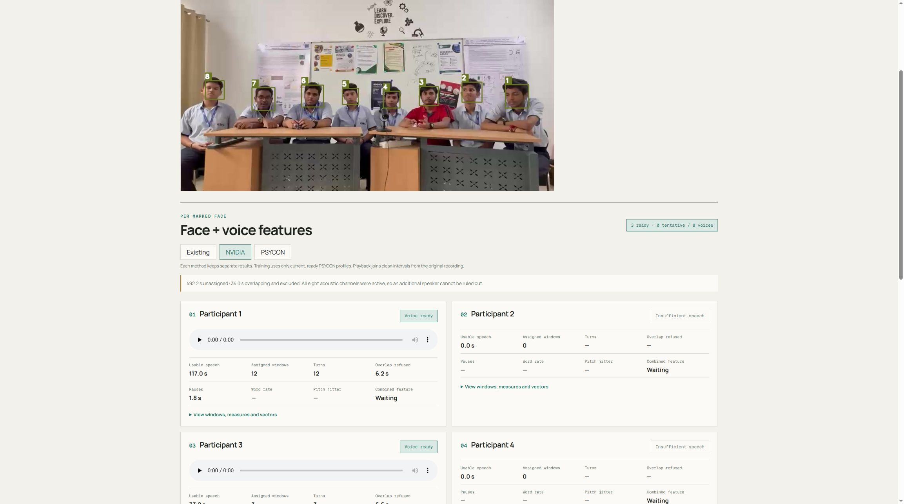

# Suggested title

add group observation and guarded voice profiling

# Suggested description

## What changed

- Add numbered group sessions, consent records, A–T marksheets, and evidence-linked ratings.
- Keep Existing, NVIDIA, and PSYCON voice analyses separate in the Faces view. PSYCON uses pinned Community-1, TalkNet, and SpeechBrain on the shared 16 kHz audio.
- Build assigned playback from source intervals. Exclude overlap from acoustic training and keep uncertain identities available for review.
- Train only from current, ready PSYCON profiles for the same session and participant. Keep session-separated splits and `validated_psychological_result: false`.
- Add pinned Nemotron offline and streaming comparisons, incomplete-profile audits, and an illustrated final report.
- Require named group accounts in production, separate web and GPU builds, support device-only workers, and recover interrupted voice jobs without touching other methods.

## Results

All 11 recordings have saved comparison outputs, covering 85 marked person-recording slots.
Original: 40 ready; earlier NVIDIA: 13; first PSYCON: 45; guarded PSYCON: 57;
guarded Nemotron streaming: 51; guarded Nemotron offline: 51.
PSYCON remains the training source; Nemotron remains a benchmark.
The 28 incomplete PSYCON slots stay incomplete. Accepted assignments are not
measured identity accuracy, and these results do not validate psychological predictions.

## Verification

- Python: 233 passed, six skipped. Skips cover the opt-in live integration test, missing host ffmpeg, and optional dataset/model checks.
- Live Compose integration: passed separately, including processing and a verified export.
- All nine simulated API scenarios and archive checks: passed with a device-only worker.
- Protocol: 20 tests passed; TypeScript type checking passed. Both browser scripts passed syntax checks.
- API, GPU worker, and lightweight web images built successfully.
- Chrome: numbered faces and all three tabs loaded; assigned NVIDIA audio played; an interrupted PSYCON run showed its own failure and retry control.

## Deployment

The current Render site still runs `main`; this PR has not been deployed or merged.
Private R2 storage is configured. Full group deployment needs an NVIDIA worker
and enough web memory for uploads, which currently read the whole recording.
The free Render CPU instance cannot provide that full analysis service.
A concurrent local video smoke run was interrupted when Docker stopped all
containers. It was recovered as an explicit failure, not counted as a completed
benchmark. The saved 66 comparison runs remain the benchmark evidence.

See [deployment setup](DEPLOYMENT.md) and the [illustrated report](../output/pdf/group_discussions_final_report.pdf).

The checked NVIDIA comparison view is below. The interrupted PSYCON view
is saved separately in `report_assets/release-psycon-failure.jpg`.

